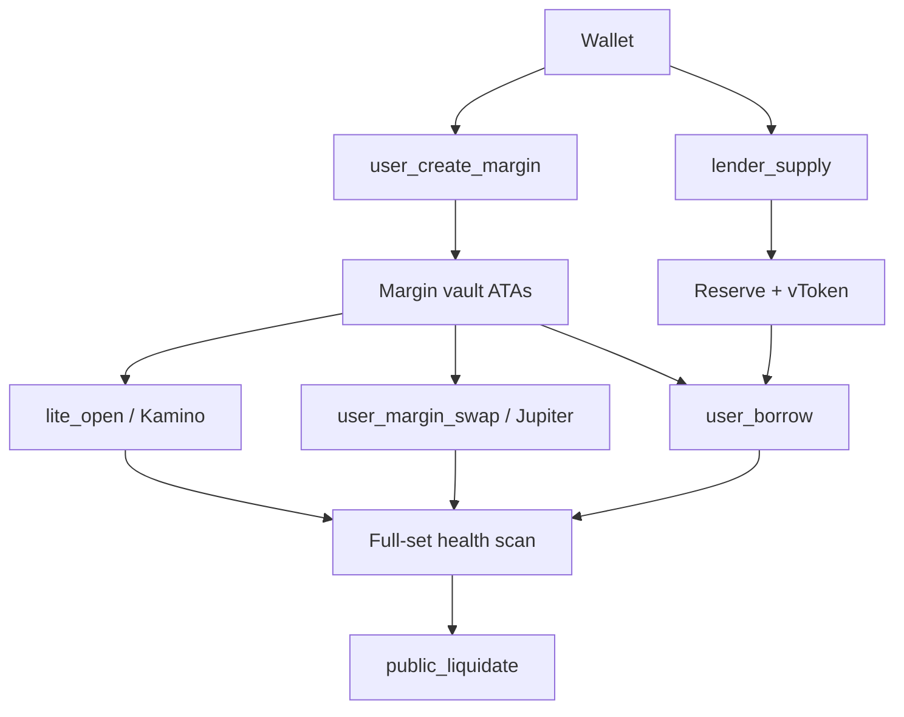

Solana splits code and state. `vanna_lending` is executable at a fixed program ID. Every pool, config, and user account is a separate PDA the program owns.

| Component | Role |
|---|---|
| `ProtocolConfig` | Admin, treasury, operating mode, max assets |
| `AssetConfig` | Per-mint LTV, liq threshold, bonus, Pyth feed, decimals |
| `Reserve` | Per-mint lending pool, share mint, rate curve |
| `MarginAccount` | One per wallet; 24-slot collateral/debt indexes + Lite registry |
| `DebtPosition` | Borrow shares for one (margin, reserve) |
| `LiteStrategyConfig` / `LitePosition` | Approved Kamino path and user receipt |
| Pyth `PriceUpdateV2` | Staleness + confidence gated prices |
| Jupiter v6 | Margin and perp swaps |
| Kamino klend | Deposit / redeem CPI and frontend main-market supply |

Earn never touches a margin PDA. Margin never spends Earn vTokens as collateral unless the user redeems first and deposits the underlying.

See [Developer Architecture](/developers/architecture) for the account graph and remaining-accounts convention.
